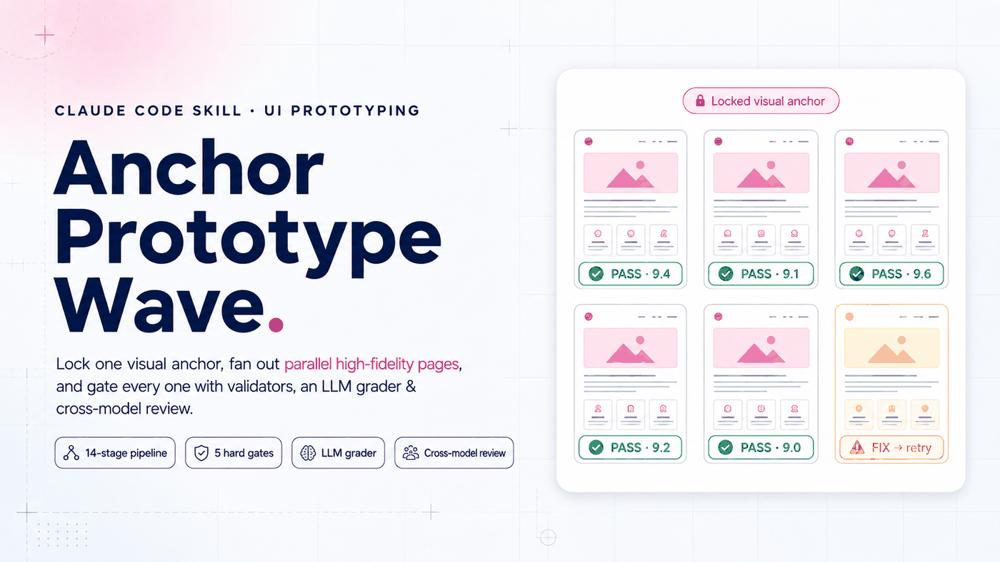
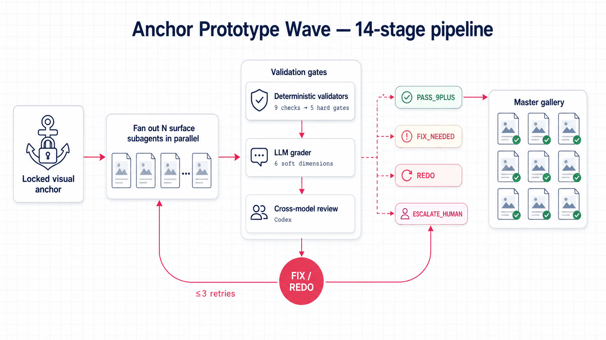
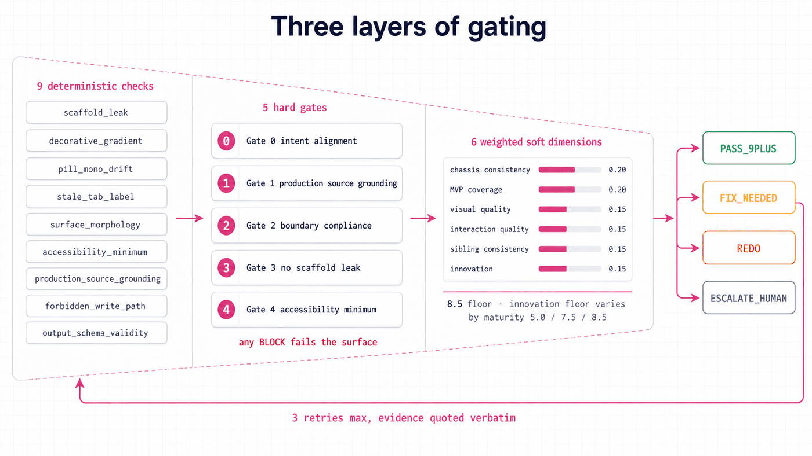
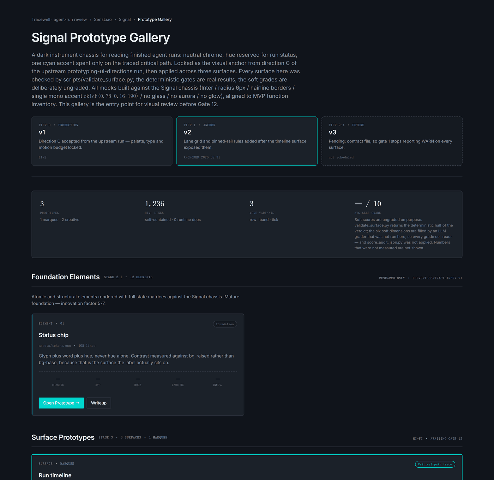
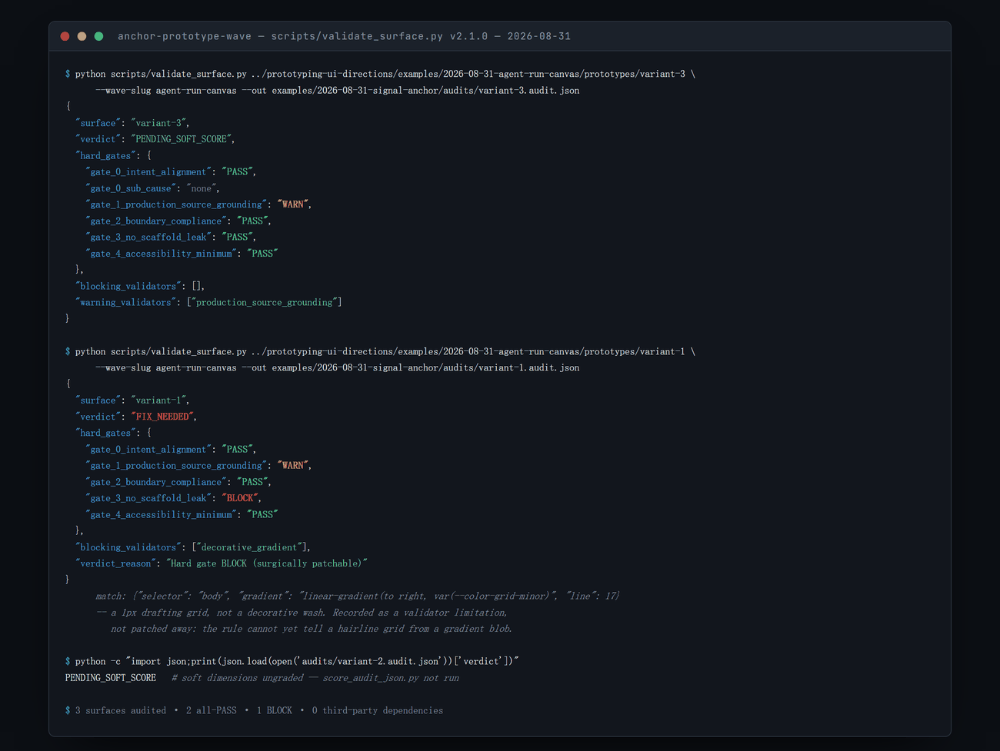

<div align="right"><a href="README.md">English</a></div>

<p align="center"></p>

<p align="center">
  
  
  
</p>

`anchor-prototype-wave` 是一个 Claude Code skill：给它一个锁定的视觉 anchor 和一份页面清单，它在一次运行里产出整波高保真 HTML 原型。它并行派发每页一个的 surface 子代理，然后让每一页穿过三层门禁——确定性校验器、LLM 评分器、跨模型（Codex）复审——失败的页面就地修复后才聚合进主画廊。它为这样的设计师和工程师而造：需要很多页面都忠实于同一个参照，又不想逐页人工检查风格漂移和残留脚手架。

<p align="center">
  <a href="#-快速开始">快速开始</a> ·
  <a href="#-14-阶段管线">管线</a> ·
  <a href="#-质量门禁">质量门禁</a> ·
  <a href="#-模型配置">模型配置</a> ·
  <a href="https://github.com/SensLiao/prototyping-ui-directions">上游 skill</a>
</p>

## 🧭 概览

**问题。** 设计方向定稿之后，剩下的十五个页面还是得有人做出来——而且每一页都要贴住底盘。LLM 擅长生成单页、不擅长在二十页之间保持一致：强调色会漂移、占位文本会混进"已完成"的页面，人类审阅者最终还是要逐页用眼睛重新审。审阅负担随页数线性增长，这就抵消了生成的意义。

**方案。** 这个 skill 把页面量产变成一条带门禁的管线。anchor（字体、配色、圆角、间距、禁用样式）被冻结成一份每个子代理都必须读的书面契约；页面并行生成，然后接受三种裁决——一个模型无法与之争辩的确定性 Python 校验器、一个按书面评分锚点对六个加权维度打分的 LLM 评分器、以及来自*另一个*模型家族的第二意见复审。失败的页面会带着逐字引用的失败证据重试，至多三次；仍然失败的升级给人决断，而不是悄悄混进交付。

**范围。** 这是一个 Claude Code *skill*——一份 Markdown 定义的编排规程加两个独立 Python 脚本——不是库也不是应用。它从不自动触发（`disable-model-invocation: true`），只能显式调用。生成的 wave 落在你项目的 `ui-lab/` 目录里，不存放在本仓库。

**关键术语**（写给冷启动读者）：**surface** 是原型的一个页面/屏幕；**anchor** 是每个 surface 都必须贴合的锁定视觉参照；**scaffold leak（脚手架泄漏）** 是混进成品页面的占位或样板内容。

## ✨ 亮点

- **14 阶段管线（Stage 0–13）**，在一次对话式运行中把 wave 从锁定 anchor 带到聚合画廊——没有 flag、不用选模式。
- **并行 surface 子代理**，每批 ≤10、超出自动分批，大页面清单无需手工切分。
- **模型说不动的确定性底线** — 9 项脚本化检查聚合成 5 个硬门禁，由仅用标准库的 Python 校验器执行。
- **锚定评分卡的软评分** — 6 个加权维度，按页面成熟度（`mature` / `creative` / `marquee`）设置分数下限，归结为四种裁决：`PASS_9PLUS`、`FIX_NEEDED`、`REDO`、`ESCALATE_HUMAN`。
- **失败就修，绝不假通过** — 失败的 surface 就地修复（≤3 次重试，每次重试的提示词逐字引用失败门禁的证据）；重试耗尽升级给人，从不自动放行。
- **跨模型复审** — Codex 复审全部失败页外加 15% 抽样的通过页；在有记录的试点里，它在 4 次 `REDO` 争议中推翻了初审 2 次——这正是引入第二个模型家族的理由。
- **共享的评审词汇表** — 12 种 surface 形态类型加 10 条枚举反模式，让"这页不对"具体、可复现。
- **构造上的模型无关** — 所有模型选择来自六个环境变量；skill 与脚本中没有任何硬编码模型名。

## 📊 实战证据

这条管线蒸馏自一次真实的两天生产运行，记录在 [`examples/2026-05-12-track-b-v2-wave.md`](examples/2026-05-12-track-b-v2-wave.md)：**15 个原型页面、34,991 行 HTML，约 16 小时完成，对照估算的约 70 顺序小时（约 4.4×）**，平均自评 9.0，未触碰任何生产代码。随后 v2.1 的晋升门禁做了 12-surface 实测，记录在 [CHANGELOG](CHANGELOG.md)：校验器复现性 12/12，抵达画廊的脚手架泄漏 0/12。wave 产物本身留在来源项目中，不在本仓库——以上数字均出自那些书面记录。

## 🏗 架构

<p align="center"></p>

<p align="center"><sub>一个 anchor、N 个并行 surface、三层门禁，加一条修复回路，然后才是画廊。</sub></p>

一次运行分三个阶段。**契约先行**：anchor 被写成声明文档、可复用元素清单被冻结、每个页面在任何生成开始前都拿到一份机器可读的 `SurfaceContract`——没有契约就派发子代理是被明文列入的反模式之一。**并行生成**：每个 surface 子代理读取共享上下文、只写唯一一个文件（自己的 `<slug>/index.html>`），代理之间不可能互相踩踏。**门禁、修复、聚合**：每一页都过确定性校验器、LLM 评分器、（按触发矩阵）跨模型复审；失败的带着证据回炉，幸存者聚合进带逐页裁决徽章的主画廊。

## 🔢 14 阶段管线

| 阶段 | 做什么 |
| --- | --- |
| 0 — Anchor 文档撰写 | 把锁定的 anchor 写进 `audits/anchor-decl.md`。 |
| 1 — 元素索引冻结 | 冻结可复用元素清单（`audits/element-index.md`）。 |
| 2 — 上下文撰写 | `audits/_context.md` — 每个子代理都要读的底盘契约。 |
| 3 — Surface 分类 | 每页标注 `mature` / `creative` / `marquee`，并对照 12 种形态定型。 |
| 4 — Surface 契约 | 每页一份机器可读的 `SurfaceContract` JSON。 |
| 5 — 并行生成 | 派发 N 个 surface 子代理（每批 ≤10）；每个只写自己的 `<slug>/index.html`。 |
| 6 — 确定性校验 | `scripts/validate_surface.py` 对每页跑 9 项检查。 |
| 7 — LLM 评分 | 六个软维度按书面评分锚点打分。 |
| 8 — 计分 | `scripts/score_audit_json.py` 算综合分、套成熟度下限、出裁决。 |
| 9 — 跨模型复审 | Codex 按触发矩阵复审（全部失败 + 15% 通过抽样）。 |
| 10 — 失败修复回路 | `FIX_NEEDED` → 外科式补丁；`REDO` → 全新重写；≤3 次后 `ESCALATE_HUMAN`。 |
| 11 — 主画廊 | 幸存页面聚合进可筛选的画廊 `index.html`。 |
| 12 — 清单与收尾 | 更新 `manifest.json`；新失败模式追加进回归清单。 |
| 13 — 汇报 | 数量、画廊链接、需人决断项，报告给你。 |

## 🚦 质量门禁

<p align="center"></p>
<p align="center"><sub>每个 surface 都要穿过的漏斗：先是确定性底线，再是带成熟度下限的加权评分，最后是裁决——失败的带着证据回炉。</sub></p>

**硬门禁** — 确定性底线。校验器的 9 项检查聚合成 5 个门禁；任何 `BLOCK` 都直接判负，无论其他维度分数多高（拿高平均分当豁免正是反模式 A1）：

| 门禁 | 来源检查 | 抓什么 |
| --- | --- | --- |
| 0 · 意图对齐 | `surface_morphology` | 页面做成了错误的*类型*（把抽屉做成了整页），附 `sub_cause` 让修复有的放矢。 |
| 1 · 生产源落地 | `production_source_grounding` | 页面无视契约点名的真实生产来源。 |
| 2 · 边界合规 | 由编排层执行 | 子代理写了自己 `<slug>/index.html` 之外的文件。 |
| 3 · 无脚手架泄漏 | `scaffold_leak` + `decorative_gradient` | 占位样板内容，以及语义白名单之外的装饰性渐变。 |
| 4 · 可访问性底线 | `accessibility_minimum` | 未达到可访问性下限。 |

另有三项检查（`pill_mono_drift`、`stale_tab_label`、`output_schema_validity`）作为咨询性提示与审计 JSON 完整性检查运行，不进入门禁。

**软维度** — 按书面评分锚点打 0–10 分，再按权重合成：

| 维度 | 权重 | 下限 |
| --- | --- | --- |
| 底盘一致性 | 0.20 | 8.5 |
| MVP 覆盖 | 0.20 | 8.5 |
| 视觉质量 | 0.15 | 8.5 |
| 交互质量 | 0.15 | 8.5 |
| 兄弟页一致性 | 0.15 | 8.5 |
| 创新性 | 0.15 | 按成熟度 5.0 / 7.5 / 8.5（`mature` / `creative` / `marquee`） |

综合分 **9.0** 是质量线；任何维度触及下限都判 `FIX_NEEDED`，综合分再高也不豁免。随成熟度浮动的创新下限，正是"设置页可以朴素、招牌页不许平庸"的机制。

## 🚀 快速开始

### 环境要求

- **Claude Code**（skill 宿主）
- **Python 3.10+**，用于两个校验/计分脚本——仅标准库，无需安装任何依赖
- **`codex-dispatch`** skill 加 Codex CLI，用于跨模型复审阶段（管线其余部分没有它也能运行）

### 安装

```bash
# 安装到当前项目
git clone https://github.com/SensLiao/anchor-prototype-wave .claude/skills/anchor-prototype-wave
```

<details>
<summary>全局安装（所有项目可用）</summary>

```bash
git clone https://github.com/SensLiao/anchor-prototype-wave ~/.claude/skills/anchor-prototype-wave
```

</details>

### 调用

对话式地发起一个 wave，给出 skill 需要的两样东西——anchor 和页面清单：

```text
用 ui-lab/v2-anchor/ 里的 anchor，把这些页面全生成出来：
dashboard, case-library, case-workspace, settings, login
```

### 预期效果

只有输入不完整时 skill 才会停下来问你——否则整条管线无人值守跑完。产物落在 `ui-lab/<日期>-<anchor-slug>-anchor-prototypes/` 下：每页一个 `<slug>/index.html`，一个 `audits/` 目录（anchor 声明、逐页契约与审计 JSON），以及带逐页裁决徽章的主画廊 `index.html`。三轮修复后仍为 `ESCALATE_HUMAN` 的页面会列出来等你决断——绝不悄悄混入。

## 🧾 输入参考

**anchor（底盘）** 必须声明：字体（无衬线族 + 字重、等宽族）、圆角尺度、发丝线宽度、单一强调色（第二个需显式声明）、禁用 token（如 glass/blur/aurora/默认深色/装饰性渐变）、状态色（amber/blue/green/red，含背景+前景）、表面与文字色角色、间距尺度、阴影值。[`ASSETS/anchor-doc-template.md`](ASSETS/anchor-doc-template.md) 是可直接填写的骨架。

**页面清单** — 每项包含：kebab-case 的 `slug`、显示标题、一行意图、路由、分组，以及可选的状态/风险提示与显式内容简报。**输出目录**默认 `ui-lab/<日期>-<anchor-slug>-anchor-prototypes/`。

## 🔧 独立运行校验脚本

两个脚本零依赖，可在 skill 之外单独运行——用于抽查单页或接入你自己的流程：

```bash
python scripts/validate_surface.py <surface-dir> --contract audits/contracts/<slug>.contract.json
python scripts/score_audit_json.py <surface-dir>/_audit.json --quality-bar 9.0
```

`validate_surface.py` 把完整审计 JSON 写在页面旁边，并向 stdout 打印紧凑摘要——`surface`、`verdict`、`hard_gates`、`blocking_validators`、`warning_validators`、`audit_path`。注意：**裁决为失败时退出码仍是 0**（退出码 2 只表示目录或 `index.html` 缺失），所以 CI 包装应解析 stdout JSON 里的 `verdict` 字段而非退出码。`score_audit_json.py` 接受 `--weights <weights.json>` 重设六维权重（必须加和为 1.0）。

## 🖼 一次真实审计，已随仓库提交

[`examples/2026-08-31-signal-anchor/`](examples/2026-08-31-signal-anchor/) 真实地跑了本 skill 两个可执行的部分：用真实 anchor 填好的 master gallery，以及对上游 skill [`prototyping-ui-directions`](https://github.com/SensLiao/prototyping-ui-directions) 产出的三个 surface 真正执行 `validate_surface.py`。

<p align="center"></p>

<p align="center"><sub><code>ASSETS/master-gallery-template.html</code> 的 74 个占位符全部由锁定的 Signal chassis 填充——<code>Inter</code>/<code>JetBrains&nbsp;Mono</code>、6px 圆角、发丝边框、唯一强调色 <code>oklch(0.78 0.16 190)</code>。这张画廊本身就是用它所展示的那套 anchor 建的，这正是在任何单个 surface 被提拔之前、在集合规模上验证 chassis 的方式。</sub></p>

<p align="center"></p>

<p align="center"><sub>真实输出。三个 surface 受审，两个全 PASS，一个 BLOCK——而那个 BLOCK 才是有意思的地方。</sub></p>

**校验器报了个误判，而这个误判被原样保留了下来。** `variant-1` 被 `decorative_gradient` 拦下，命中的是 `{"selector": "body", "gradient": "linear-gradient(to right, var(--color-grid-minor)", "line": 17}`——但那根本不是装饰，而是**1px 的绘图网格**，正是那个方向全部的视觉前提。所以这条结论是关于**规则**而不是关于页面的：`check_decorative_gradient` 目前还分不清发丝网格与渐变色块。它被[记录在示例里](examples/2026-08-31-signal-anchor/)，连同显而易见的改法（豁免色标间距 ≤2px 的渐变），而不是悄悄改掉——因为凭一个样本就放宽门禁，正是门禁失去意义的开始。

**管线的另一半是刻意没跑的。** `score_audit_json.py` 是在 LLM 评分器补齐六个软维度**之后**才套用 §4 判定规则的。这里没有跑评分器，所以所有软分为 null、画廊里每个评分格都显示 `—`、`AVG SELF-GRADE` 显示 `—/10` 而不是一个编出来的数字。那两个 surface 拿到的 `PENDING_SOFT_SCORE`，含义正好就是这个。

## 🎛 模型配置

任何地方都没有硬编码模型名。所有路由来自六个环境变量（默认值见 [`references/model-policy.md`](references/model-policy.md)）：

| 变量 | 默认值 | 用途 |
| --- | --- | --- |
| `CLAUDE_DECISION_MODEL` | `claude-opus-4-7` | 编排、anchor 撰写、creative/marquee 页面 |
| `CLAUDE_EXECUTION_MODEL` | `claude-sonnet-4-6` | mature 页面、逐页评分 |
| `CLAUDE_TOOL_MODEL` | `claude-haiku-4-5-20251001` | 摘要、JSON schema 检查 |
| `CODEX_REVIEW_MODEL` | `gpt-5.5` | `REDO` / `FIX_NEEDED` 的完整跨模型复审 |
| `CODEX_LIGHT_MODEL` | `gpt-5.4-mini` | 15% 通过抽样与修复后复检 |
| `CODEX_FALLBACK_MODEL` | `gpt-5.4` | 主模型不可用时（回退会记入审计） |

## 🗺 仓库地图

| 路径 | 内容 |
| --- | --- |
| [`SKILL.md`](SKILL.md) | 完整管线定义——阶段、停止规则、触发矩阵、反模式。 |
| [`scripts/`](scripts/) | `validate_surface.py`（439 行）+ `score_audit_json.py`（203 行）——仅标准库。 |
| [`examples/`](examples/) | 一张真实填充的 master gallery，以及一次真实校验运行留下的三份 `SurfaceAudit` 文档。 |
| [`references/`](references/) | 规则手册：[`gates.md`](references/gates.md)、[`scoring-rubric.md`](references/scoring-rubric.md)、[`surface-taxonomy.md`](references/surface-taxonomy.md)（12 种形态）、[`failure-patterns.md`](references/failure-patterns.md)（回归案例）、[`model-policy.md`](references/model-policy.md)、[`output-schema.md`](references/output-schema.md)（4 个 JSON schema）、[`master-gallery-structure.md`](references/master-gallery-structure.md)、[`skills-dependencies.md`](references/skills-dependencies.md)。 |
| [`ASSETS/`](ASSETS/) | 11 份可填写模板：anchor 声明、共享上下文、surface/element 提示词、Codex 复审提示词、画廊 HTML、质量门禁清单、writeup。 |
| [`examples/`](examples/) | 试点运行记录与空白项目模板。 |
| [`CHANGELOG.md`](CHANGELOG.md) | v1 → v3.0.0 演进史，含每个版本的晋升证据。 |

## 🔗 与 prototyping-ui-directions 的关系

[`prototyping-ui-directions`](https://github.com/SensLiao/prototyping-ui-directions) 是上游搭档：它从模糊想法和几个参照里发现设计方向。`anchor-prototype-wave` 则把选定的方向作为锁定 anchor，量产出全套高保真页面。

## 🖥 兼容性

| 组件 | 支持情况 |
| --- | --- |
| Skill 宿主 | Claude Code（安装进 skills 目录；仅显式调用） |
| 脚本 | Python 3.10+，仅标准库，跨平台 |
| 跨模型复审 | 经单独安装的 `codex-dispatch` skill 调用 Codex CLI |
| 生成页面 | 自包含 HTML，无构建步骤 |

## 📊 项目状态

skill 处于**稳定、经试点批准**的状态——当前 v3.0.0 把早期的 flag/模式界面收敛成纯对话式，同时保留了 v2.1 的全部校验机制（旧的带 flag 提示词仍被理解，flag 被直接忽略）。确定性校验器、门禁、计分、重试回路与跨模型触发矩阵是经过批准的核心。两点诚实的说明。边界合规门禁由编排层执行，而非独立校验脚本。另外，虽然 [`examples/2026-08-31-signal-anchor/`](examples/2026-08-31-signal-anchor/) 现在附带了一张真实填充的画廊和三份真实审计，但它**不是一次完整的 wave**——没有 LLM 评分环节、没有重试回路、没有跨模型评审；完整 wave 的产物仍然留在运行它的项目里。

## 📄 许可证

以 MIT 许可证发布 — 见 [`LICENSE`](LICENSE)。

<p align="center"><sub>由 <a href="https://github.com/SensLiao">Ruixuan "Sens" Liao</a> 构建 · 悉尼大学 Advanced Computing（Honours）</sub></p>
